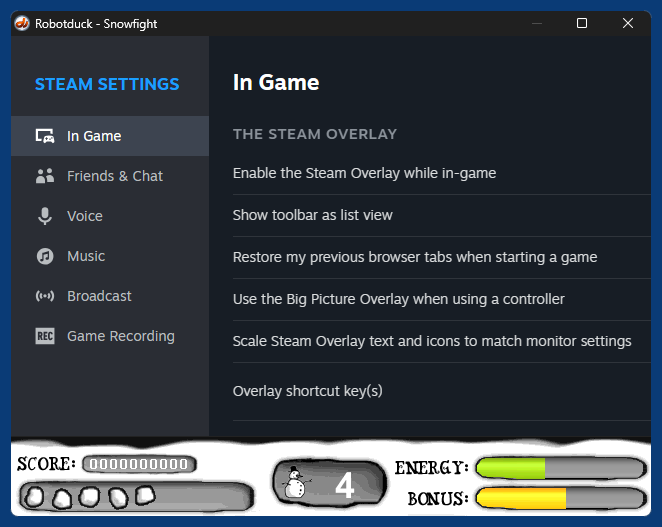

# SteamXtra

Stub for integrating the Steamworks SDK into games created with Adobe Director for Windows

## Current interface

```
-- xtra SteamXtra
-- v0.2 (c) 2025 59de44955ebd
-- https://github.com/59de44955ebd/SteamXtra

new object me

SteamAPI_RestartAppIfNecessary object me, integer appID
SteamAPI_Init object me
SteamAPI_Shutdown object me
SteamAPI_IsSteamRunning object me

-- ISteamFriends
ISteamFriends_GetPersonaName object me
ISteamFriends_ActivateGameOverlay object me, string dialogName
ISteamFriends_ActivateGameOverlayToUser object me, string dialogName, string steamID

-- ISteamUser
ISteamUser_GetSteamID object me

-- ISteamUserStats
ISteamUserStats_GetAchievement object me, string achievement
ISteamUserStats_SetAchievement object me, string achievement
ISteamUserStats_GetStatFloat object me, string statName
ISteamUserStats_SetStatFloat object me, string statName, float data
ISteamUserStats_GetStatInt object me, string statName
ISteamUserStats_SetStatInt object me, string statName, integer data
ISteamUserStats_StoreStats object me
ISteamUserStats_ResetAllStats object me, integer bAchievementsToo
ISteamUserStats_GetNumberOfCurrentPlayers object me, symbol callback

-- ISteamUtils
ISteamUtils_GetAppID object me
ISteamUtils_GetIPCountry object me
```

### Global callbacks (put handlers with those names into movie script to get notified):
- OnSteamServersConnected
- OnSteamServersDisconnected
- OnGameOverlayActivated (boolOverlayNowVisible)

## Screenshots

*Director 11.5 demo*  


*Shockwave3D game (Director 10) with integrated Steam overlay*  


## Compiling

Compiling the xtra requires MS Visual Studio 2017 or later, the free community edition is of course fine.
The repository includes both the Streamworks SDK and the Adobe XDK, so there are no other dependencies.
